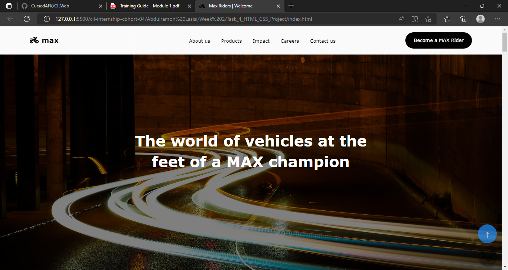

## Overview

### The challenge

Users should be able to:

- See hover states for interactive elements
- Interact with links

### Screenshot

### Links

- Live Site URL: [Live Site](https://cursedafk.github.io/CILWeb/)

### Built with

- Semantic HTML5 markup
- CSS custom properties
- Flexbox
- Mobile-first workflow

## Author

- Twitter - [@AbdulRLass](https://twitter.com/AbdulRLass)

#### Side Notes

I wasn't able to successfully load font awesome cdn, so i had get the icons in locally..
