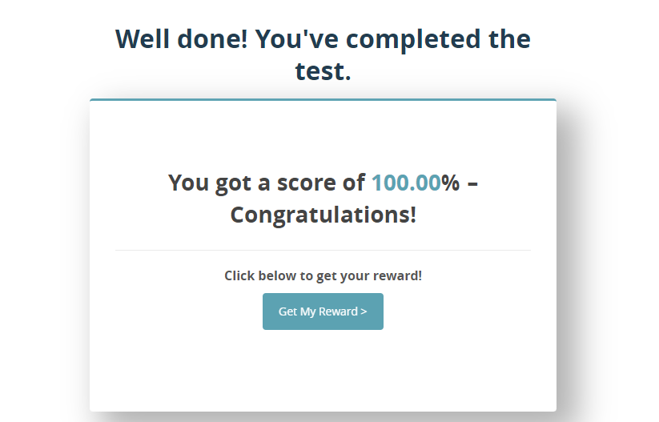

# Question 1
## My findings after taking the Test.

Each of the tutorials have test and the subjet matter UX Design is broken down into six tutorial that explain the neccessary concept in Ux starting from "What Is UX Design?" to "How (And Why) To Become A Professional UX Designer"

## Tutorial 1: The Different Areas Of UX Design
I understand that any interaction a user can have with a product is the user experience. Don Norman coin the term UX design in the 1990s.  
I understand that a typical UI/Ux person is expected to Interview users (research), create wireframes and build prototypes of the product.  
I learnt that a wireframe is a freehand or digital drawing of a design and they are important because they show how a product will function.  

## Tutorial 2: The Different Areas Of UX Design
I got to know about the UX design process which are;
* User research
* User research analysis—Affinity mapping
* User personas & user flows
* Wireframes & prototypes 
* User testing  
I find out that a UX role is different from a UI role, I Also got the understanding that a UI Designer picked up from where a UX Designer stoped and hand over the design to developers  who will bring your designs to life and turn them into functional products.  

## Tutorial 3: The Different Areas Of UX Design  
Tutorial 3 talked about the different areas of ux design and introduced me to the UX design quadrant model while usinf the lens of the quadrant to look at the specializations of UX design which helps groups the field into four main disciplines:
* Experience Strategy (ExS)
* User Research (UR)
* Information Architecture (IA)
* Interaction Design (IxD)

## Tutorial 4: The Skills You Need To Be A UX Designer  
this chapter talked about the most important soft and hard skills for UX designers and listed them as follows.
* Communication
* Empathy
* Organization
* User research
* Information architecture 
* Wireframing and prototyping  
This chapter stated and reemphazise that UX goes beyond just design but is about the process of design and how you channel your users’ needs. A UI designer is more likely to be responsible for the aesthetics of a product, while the UX designer is more concerned with how the overall experience feels.

## Tutorial 5: Tips For Your First Great UX Portfolio
THis chapter explain what a UX portfolio and UX design case study is and why a UX designer needs  one. How to go about the portfolio and what to include in the portfolio.

## Tutorial 6: How (And Why) To Become A Professional UX Designer  
This chapter talked about average UX designer salaries, their demands in the market, and explain the possible ways to become a UX designer. 

Here is my final result.

# Question 2
## UI/UX Fundamentals
### What is UX?  
First, let’s break down what we mean when we say, “user”—or better yet, who we mean. Simply put, a user is a person who purchases or interacts with a product, digital interface, or service. Therefore, a user experience (UX) is the series of events that occur when that person actually uses the product, digital interface, or service.  

And UX design is the process of discovering user needs and designing solutions to meet them.   
If UX design is the art of carefully curating the experience a user will have when interacting with a certain product or service, UX designers are the artists who do the work of creating that experience.

### The five main principles of UX design  
There are many important principles within UX design but to simplify things a bit, we’ve broken them down into five main concepts: Empathy, strategy, usability, inclusivity, and validation.

* Empathy  
Quality UX design puts users’ needs at the forefront of product development. To understand the user and what obstacles they face, UX designers must practice empathic design. With empathy, designers are able to put themselves in the user’s shoes and learn about their daily life, what problems they need solved, what expectations they have when interacting with certain products, and what a good experience looks like to them.  

* Strategy
Designing effective solutions to difficult problems can be a complex process. Therefore, a crucial part of UX design is having a well-defined plan and set of goals before starting any project. Many designers will craft a UX strategy that outlines a variety of UX objectives including chosen research methods, preferred design and testing systems, and what success looks like for both the user and the business.  

* Usability
In a world of rapidly advancing and sometimes confusing technology, consumers often lean towards products that take little brain power to operate. The last thing a user wants is to feel like ordering food delivery on their phone is equivalent to completing a 1000 piece puzzle. A big part of UX design is making products and services that are simple and intuitive to use for people of all ages and abilities.  

* Inclusivity
A common phrase you may hear in the UX industry is “design for all”—meaning that our design efforts should take into account the needs of people of all races, ages, genders, backgrounds, socioeconomic statuses, and more. UX designers have the ability to shape the world around them through their designs and the power to solve complex problems that affect a wide range of individuals.  

* Validation
However impressive a design may seem, it would mean nothing if not validated by user testing. One of the most crucial aspects of UX design is to test proposed solutions with the people who will actually be using them in real life. User feedback guides and informs the design process and helps ensure that the products being made are ones people will happily want to use. Even after products are released, designers are constantly using methods to assess their success and where improvements can be made.

### Five Steps to Design Process  
To understand about what UX designers do, let’s look at the UX design process:  

* Empathy is key—and user research is essential to finding that understanding and connection to your users’ needs and goals. So the first step is to conduct extensive  and inclusive research about the people who will be interacting with the product. There are many ways designers can learn about their users.  

* Define  
After they’ve come to understand their users needs and goals, UX designers figure out and define what problems need solving, and set direct guidelines for the tasks ahead.  
Here UX designers get a clear idea of the project their client or employer has for them and what the goals for the business are.  

* Ideate  
This stage often happens recursively throughout the defining, prototyping, and even testing stages—you discover user needs and your imagination starts coming up with ways to solve those problems! But skilled UX designers also know how to come up with ideas in systematic ways. Ideation often happens, then, in a design thinking workshop.  

* Prototype  
Now, it’s time to put pen to paper and start designing! This is the phase that most people think of when it comes to UX design as it involves the actual creation of the product or service. Designers create mockups and prototypes to initially test their ideas to make sure they’ll actually work as intended.  

* Test  
As we’ve already hinted, no UX design process is complete without testing your design solutions to ensure that they’ll actually work the way you intend! So, now that a design has been created, it’s time to test that design against actual users with usability testing. Designers will observe their users interact with their designs and ask them to complete certain tasks or sort information. They take note of the user’s emotions, body language, statements, frustrations, and difficulties they have when using the product. After testing, designers compile the data, analyze it, and determine what improvements need to be made.  

* Then…iterate!  
The UX design process is a cyclical one meaning that once the designs have been created and user feedback has been obtained, it’s time to repeat the steps again. With each cycle of the design process, designers take what they’ve learned from previous ones and address new problems, make meaningful improvements, and design more effective solutions. Even after product release, designers will continue to obtain user feedback and iterate upon their original designs.